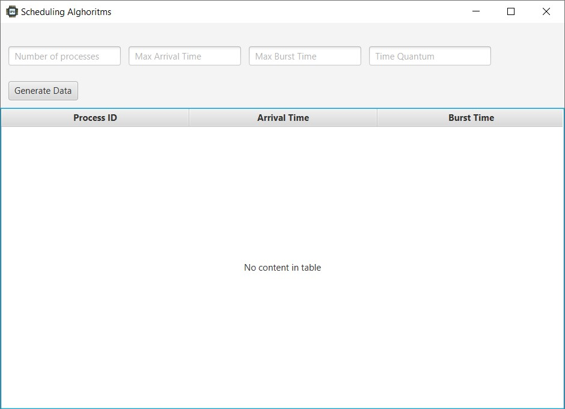
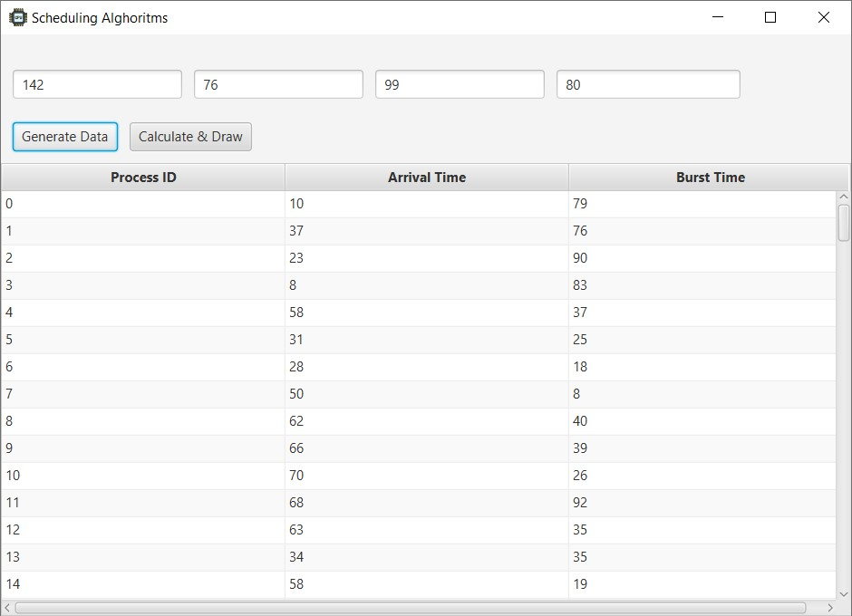
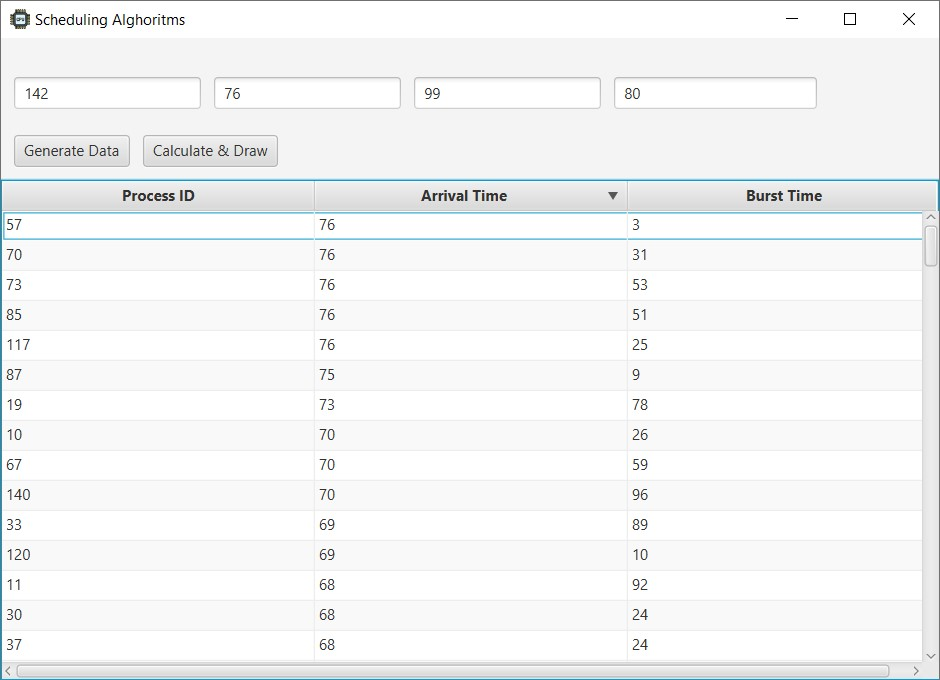
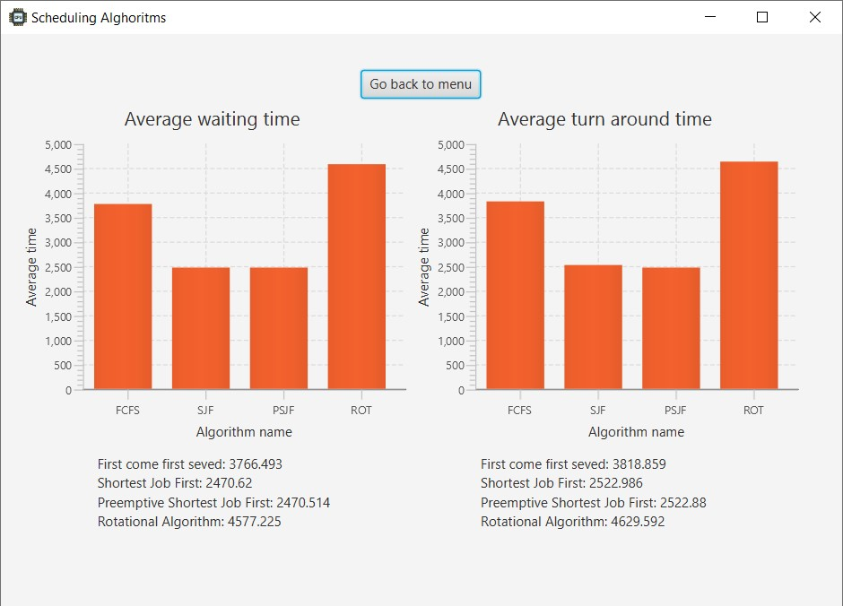

Introduction
============

CPU Scheduling is a process of determining which process will own CPU
for execution while another process is on hold. We can distinguish two
kinds of Scheduling methods: pre-emptive and non pre-emptive. In
pre-emptive Scheduling, the tasks are mostly assigned with their
priorities. In Non Pre-emptive scheduling method, the CPU has been
allocated to a specific process. The process that keeps the CPU busy
will release the CPU either by switching context or terminating.

Important CPU scheduling Terminologies
--------------------------------------

**Burst Time/Execution Time:** It is a time required by the process to
complete execution. It is also called running time.
**Arrival Time:** when a process enters in a ready state
**Turn Around Time:** Turnaround time is the total amount of time spent
by the process from coming in the ready state for the first time to its
completion.

Types of CPU scheduling Algorithm
---------------------------------

**1. First Come First Serve**
First Come First Serve is the full form of FCFS. It is the easiest and
most simple CPU scheduling algorithm. In this type of algorithm, the
process which requests the CPU gets the CPU allocation first. This
scheduling method can be managed with a FIFO queue.
**2. Shortest Job First (SJF)**
Process which have the shortest burst time are scheduled first.If two
processes have the same bust time then FCFS is used to break the tie
**3. Rotational Algorithm**:
Each process is assigned a fixed time(Time Quantum/Time Slice) in cyclic
way. It is designed especially for the time-sharing system.
**4. Pre-emptive Shortest Job First**
Jobs are put into the ready queue as they come. A process with shortest
burst time begins execution. If a process with even a shorter burst time
arrives, the current process is removed or preempted from execution, and
the shorter job is allocated CPU cycle.

User interface
==============

Home page
---------

Generating data
---------------

Sorting table feature
---------------------

Calculating and displaying results
----------------------------------

Features
========

Simulation of the following algorithms 
--------------------------------------
* First come, first serve (FCFS) (Non-preemptive)
* Shortest Job First (SJF) (Non-preemptive)
* Shortest Remaining Time First (SRTF) (pre-emptive)
* Round Robin (RR) (pre-emptive)

Adjustable input parameters
---------------------------

* number of processes
* burst time max range
* arrival time max range
* quantum time

Dashboard style visualisation 
-----------------------------

* GANTT chart
* average waiting time
* average turnaround time
* process id, burst time and arrival time sortable table

Usage
=====

1. Enter custom data:
    * Number of processes
    * Range of arrival time (from 0 to given number)
    * Range of waiting time( from 1 to given number)
    * Quantum time
1. After clicking “generate data button”, “calculate and draw” buttonwill appear
1. Click calculate and draw button

Requirements to run this project
================================

* Java FX installed
* Java 8+

Conclusion
==========

After performing all calculations one can notice that the best algorithm
which offers a solution to the issue of providing the best average time
is rotational algorithm. It is worth mentioning that it mainly depends
on the time quantum. Very large time quantum makes ROT same as the FCFS
while a very small time quantum will lead to the overhead as context
switch will happen again and again after very small intervals. The major
advantage of this algorithm is that all processes get executed one after
the other which does not lead to starvation of processes or waiting by
process for quite long time to get executed. PSJF has the best average
turnaround time, followed by SJF and FCFS. ROT has the worst turnaround
time in comparison. FCFS scheduling is the simplest scheduling algorithm
but it can cause short processes to wait for very long period of time.
PSJF and SJF are improvements over FCFS, because they take into account
the burst time of every single process. It cannot be denied that
implementing these algorithms is very difficult because predicting the
length of the next process’s burst time is hardly feasible. Moreover,
both SJF and SRJF may lead to process starvation as long processes may
be held off indefinitely if short processes are continually added. When
it comes to rotational algorithm
